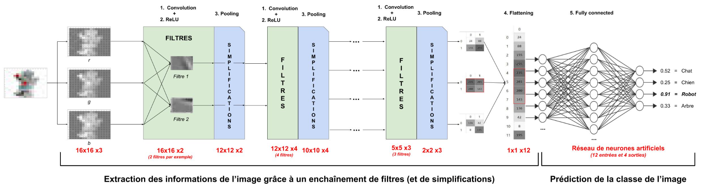
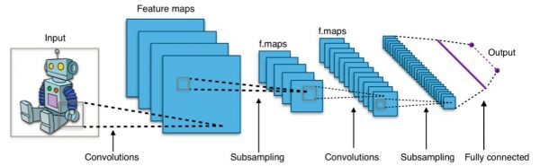
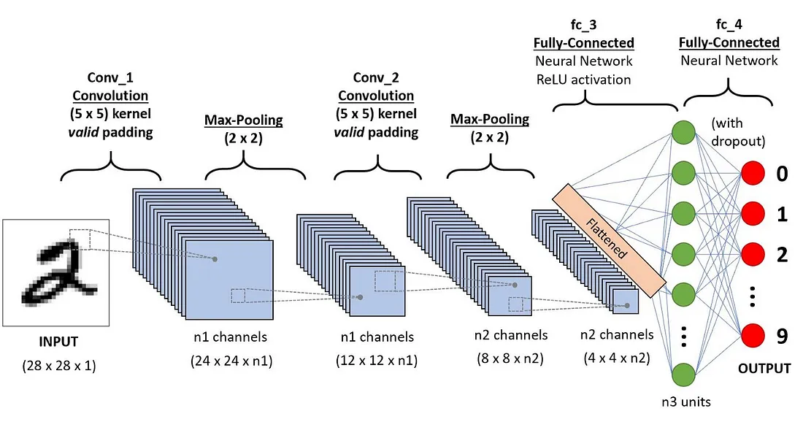

# Veille documentaire du projet DIGITS-CLASSIFICATION

## 1. Réalisez une veille sur les réseaux de neurones artificiels de type convolutifs. Quel est l’architecture typique d’un CNN ?

Un réseau neuronal convolutif (CNN) est une architecture de réseau pour l'apprentissage profond. Les CNN sont particulièrement utiles pour trouver des motifs dans les images afin de reconnaître des objets. Ils peuvent également être très efficaces pour classer des données non-image comme l'audio, les séries temporelles et les données de signal.

Un réseau de neurones convolutifs (CNN) est composé de couches convolutives pour extraire des caractéristiques, de fonctions d'activation pour introduire de la non-linéarité, de couches de pooling pour réduire la dimensionnalité, puis de couches entièrement connectées pour effectuer la classification, avec parfois des couches de dropout pour éviter le surapprentissage.

Détails des composantes principales d'un CNN

Couches Convolutives : Ces couches appliquent des filtres (noyaux) à l'image d'entrée pour en extraire des caractéristiques telles que les contours, les textures et les formes. Chaque filtre produit une carte de caractéristiques qui met en évidence certains aspects spécifiques de l'entrée.

Fonctions d'Activation : Après la convolution, des fonctions d'activation comme ReLU (Rectified Linear Unit) introduisent de la non-linéarité, permettant au réseau de modéliser des relations complexes.

Couches de Pooling : Le pooling réduit les dimensions spatiales des cartes de caractéristiques, conservant l'information la plus importante tout en diminuant la charge de calcul. Les méthodes de pooling les plus courantes incluent le max pooling et le average pooling.

Couches Entièrement Connectées : Ces couches prennent les caractéristiques de haut niveau extraites par les couches de convolution et de pooling, et les associent à la sortie finale, comme les probabilités de classes dans les tâches de classification.

Couches de Dropout : Pour éviter le surapprentissage (overfitting), les couches de dropout désactivent aléatoirement une fraction des neurones pendant l'entraînement, favorisant ainsi la capacité du réseau à généraliser.

https://medium.com/@draj0718/convolutional-neural-networks-cnn-architectures-explained-716fb197b243

2.
